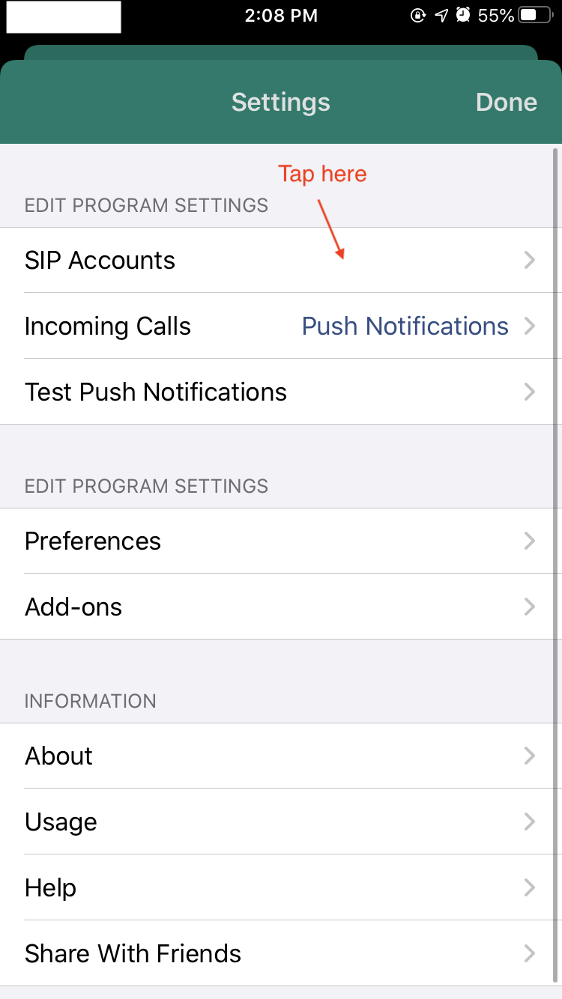
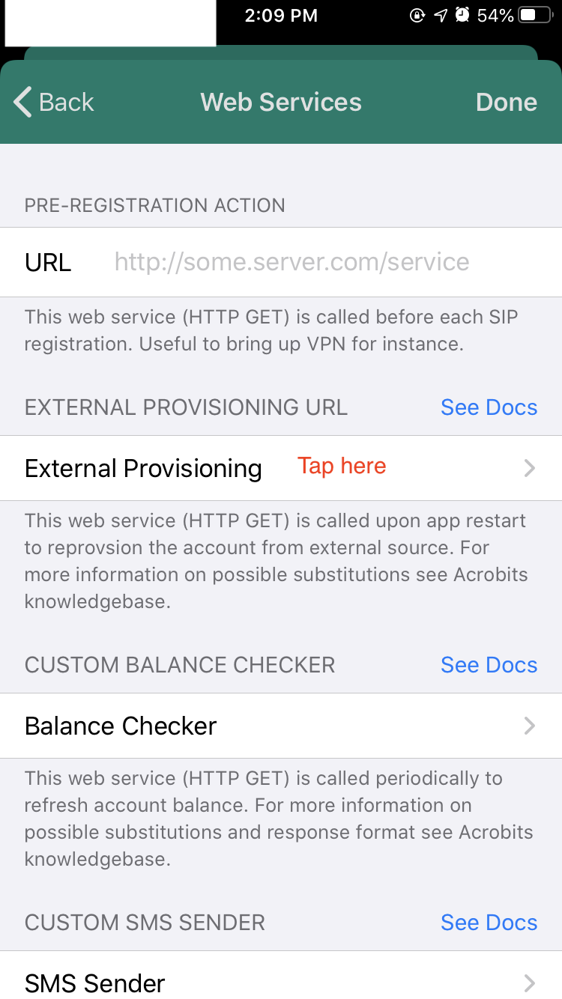

VoipBits
========

This service lets you send/receive SMS from [voip.ms](https://voip.ms/) using [acrobits softphone](https://www.acrobits.net/sip-client-ios-android/).

Comparison to smsglue
---------------------

This service is greatly inspired by [smsglue](https://smsglue.com/), but with some differences:

* VoipBits doesn't store your account information while smsglue does.

  VoipBits requires you send **encrypted** account informations along with each request 
  to the service so that the only information this service knows about you is the
  push token to your phone, which is for SMS notification.

* VoipBits requires zero fee to deploy while smsglue requires the fee for a server.

  VoipBits make uses of AWS Lambda and DynamoDB which all provides free tiers. In most situations
  hosting VoipBits on AWS will cost you 0 bucks. However, for smsglue, you need to at least
  pay for a server.
  
How to use (thanks smsglue again for the instructions)
----------

1. Enable API access for voip.ms.

   You'll need to log into your VoIP.ms account and visit Main Menu -> SOAP and REST/JSON API (or just [click here](https://voip.ms/m/api.php)).

   Scroll down to API Configuration and do the following:

   Enter an API Password (usually something different than your regular account password), enter the confirmation, and click Save API Password.
   If Enable API is disabled, click Enable/Disable API so that it shows Enabled.
   In the text box labeled, Enable IP Addresses, enter 0.0.0.0 and click Save IP Addresses.
   When finished, your screen should look something like this:
   

2. Encrypt your account credentials using provided public key.
   You can go to [here](https://www.devglan.com/online-tools/rsa-encryption-decryption), or use any RSA encryption tool you like,
   to encrypt your account credentials with my public key.

   If you use the provided website, here's the guide:
   First fill in your account credentials in the first box of the encryption section, with the format
   `<your_did>:<your_account>:<your_api_password>`, e.g. `123456789:myaccount@nowhere.com:mypassword`.
   After that paste the encryption key `MIGfMA0GCSqGSIb3DQEBAQUAA4GNADCBiQKBgQCdUvZ6oEQB5KWc0b6iUlBd/oZjspHkWFB8seL2eApnx+iTCFkpGxaGiVOxevBCIQLnAryMexeQd2y5n9Fsw2OIBsDFe9GZe4V2P5FAjtU4rKQOZm2sVr+W+IEq0LuyfBALEU56BoOUFoRQhHPUPWjGqVV3/nvqNcPb9L640X/7DQIDAQAB` to the second box. Click the `Encrypt` button and then you will get the encrypted account credentials.

   

3. Set Acrobits Softphone to use VoipBits to send and receive SMS.
   
   
   
   
   
   
   
   

   Tap Done and exit softphone completely.

4. Let voip.ms notify you if you get new SMS messages.

   Go you `Edit DID Settings` page in voip.ms and fill in the content `https://voipbits.wooya.me/notify?message={MESSAGE}&from={FROM}&to={TO}` to the 
   `SMS/MMS URL Callback` box and tick the URL Callback Retry box.

   

5. You are all set!

6. If you find you cannot send SMS, maybe this is due to a bug in softphone. You can manually set the SMS
   sending config.
   Put `https://voipbits.wooya.me/send?to=%sms_to%&body=%sms_body%` in the URL box and fill in others as the snapshot.
    
   

Report bugs
-----------

I'm using this service daily and will fix bugs if I find any. Please do not hesitate to submit an issue or PR
if you get any bugs.

Self hosting manual
----------------

Self hosting is easy with the help of [serverless](https://www.serverless.com/).

Before running `sls deploy` to actually deploy the code, 
you need to first create the corresponding DynamoDB table `voipbits-push-tokens` and an IAM role with
permission to read/write the table. You also need to have a cert setup in ACM if you want to use customer domains.
Otherwise you can just remove the `customDomain` section in `serverless.yml`.

Run `sls deploy` you will get everything deployed.
